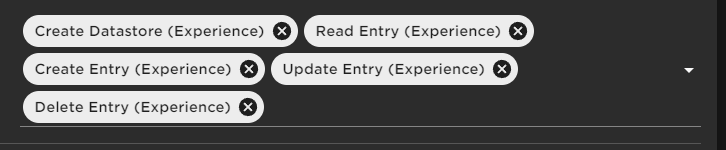

# Setting up Roblox API Token

1. First, go to [https://create.roblox.com/](https://create.roblox.com/)
2. Next, once logged in, on the left side, click on the `credentials` button.
3. Then, click the button, `Create API Key`.
4. In the API Key creations menu, go down to `Access Permissions`, click `Select API Services`, select `Datastore`, then finally, select `ADD API SYSTEM`. Follow the same process, but this time, choose the `Messaging Service API`.&#x20;
5. Next, for `Messaging Service API`, select `Publish` for `Experience Operations`. For `Datastore`, select the following operations:&#x20;

<figure><figcaption></figcaption></figure>

6. Next, scroll down to `Security`. To allow any IP connections to access your API key, add the following IP: `0.0.0.0/0`. Otherwise, feel free to add your own IP if you would like. It's recommended for tougher security.
7. Finally, at the bottom of the page, click, `Save & Generate Key`. You'll then be presented with your API. Copy the key to your clipboard. DO NOT SHARE YOUR API KEY. ANYONE WHO GAINS ACCESS TO IT WILL HAVE NEAR FULL CONTROL OVER YOUR GAME.
